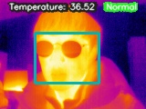
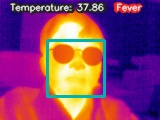

# AI-thermometer
This is a project which implement high-speed AI thermometer.

## Key features
### TensorRT
The goal was implementing AI thermometer on embedded system using deep learning-based object detection model. So we optimized SSD(Single-shot multibox detector) via TensorRT, which is the library of NVIDIA for high-performance deep learning inference. Note that the TensorRT version which we used is 6.0.1
### Using thermal imaging camera only (w/o normal RGB camera)
In general, most of the AI-based thermometers are using not only normal RGB camera but also thermal imaging camera. Because the face detection should work on normal images. Therefore, we did transfer learning, retrained SSD on custom dataset of thermal face images(using TensorFlow object detection API). We constructed the dataset by capture images on thermal imaging camera manually.

## Environment
* Platform: Jetson AGX Xavier Developer kit
* Thermal imaging camera: FLIR Lepton 3.5 + GroupGets LLC Purethermal 2
* Libraries: TensorRT (Release 6.0.1), OpenCV, NumPy, PyCUDA, etc.

## Configuration
### demo/
Final demo of this project.

### demo_face_detection/
This demo is only for face recognition on normal images(not for thermal images).

</img> 

## References
* TensorRT demo code: https://github.com/jkjung-avt/tensorrt_demos
* TensorRT documentation: https://docs.nvidia.com/deeplearning/tensorrt/developer-guide/index.html
* TensorRT python example codes: https://github.com/NVIDIA/TensorRT/tree/master/samples/python
* TensorFlow object detection API: https://github.com/tensorflow/models/tree/master/research/object_detection
* TensorFlow 1 Detection Model Zoo: https://github.com/tensorflow/models/blob/master/research/object_detection/g3doc/tf1_detection_zoo.md
* WIDER FACE dataset: http://shuoyang1213.me/WIDERFACE/
* SSD paper: https://arxiv.org/abs/1512.02325
* Another AI-thermomerter project: https://github.com/tomek-l/ai-thermometer
